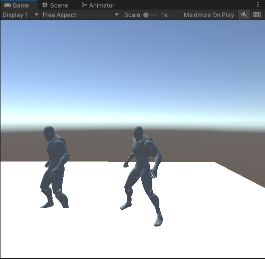

# QA

1. blockWidth、blockHeight是用来干什么的，为啥要分块呢？

```
blockWidth：是矩阵中的四行，默认是4。
blockHeight: 是SkinMeshRender中的骨骼数量。

```

2. 导出的骨骼的坐标，还是顶点的坐标？

```
骨骼坐标

```

3. LOD 怎么在 Animation-Instance 中奏效？


```
//在CPU端，将LOD信息进行计算，得出需要渲染的Mesh信息


//! 更新Lod
instance.UpdateLod(cameraPosition);

AnimationInstancing.LodInfo lod = instance.lodInfo[instance.lodLevel];


```


4. Shader 中的代码解读

```C

	//！四个通道存的是 骨骼索引编号
	half4 bone = half4(v.texcoord2.x, v.texcoord2.y, v.texcoord2.z, v.texcoord2.w);

```

其中时源于 UV2 的数据已经预备好了

```CSharp
//！写入到 UV2 上
vertexCache.mesh.SetUVs(2, uv2);
```

然后还有 mesh.Color

```C
//！四个权重，对应的是四个骨骼的权重
fixed4 w = v.color;
```

在之前也有写入

```
//！把四个骨骼的权重也写入，用 mesh.Color 这个数据存储
vertexCache.mesh.colors = colors;

```


---
As developers, we’re always aware of performance, both in terms of CPU and GPU. Maintaining good performance gets more challenging as scenes get larger and more complex, especially as we add more and more characters. Me and my colleague in Shanghai come across this problem often when helping customers, so we decided to dedicate a few weeks to a project aimed to improve performance when instancing characters. We call the resulting technique Animation Instancing.
> It needs at least Unity5.4.

# Features:
* Instancing SkinnedMeshRenderer 
* root motion
* attachments
* LOD
* Support mobile platform
* Culling

> Note:
Before running the example, you should select menu Custom Editor -> AssetBundle -> BuildAssetBundle to build asset bundle.

# Attachments:
There's a attachment scene. It shows how to use the attachments. 
How to setup the object which hold the attachment?
* Open the generator menu -> AnimationInstancing -> Animation Generator
* Enable the attachment checkbox 
* Selece the fbx which refrenced by the prefab
* Enable the skeleton's name to generate
* Press the Generate button.